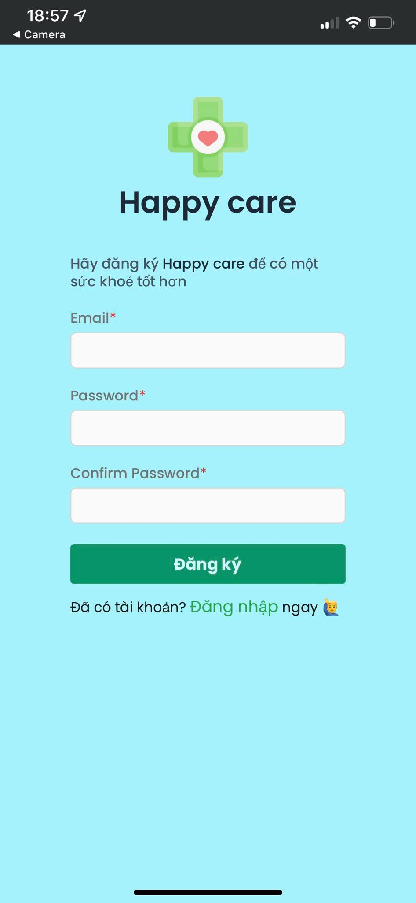
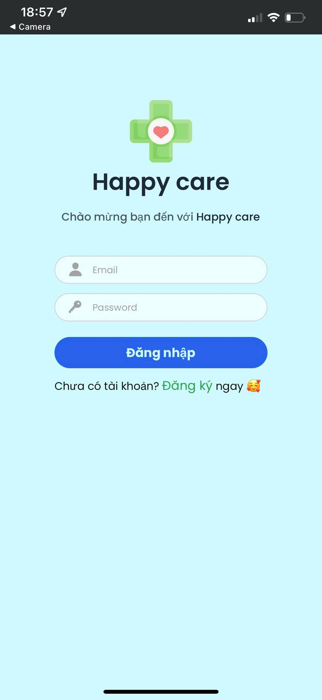
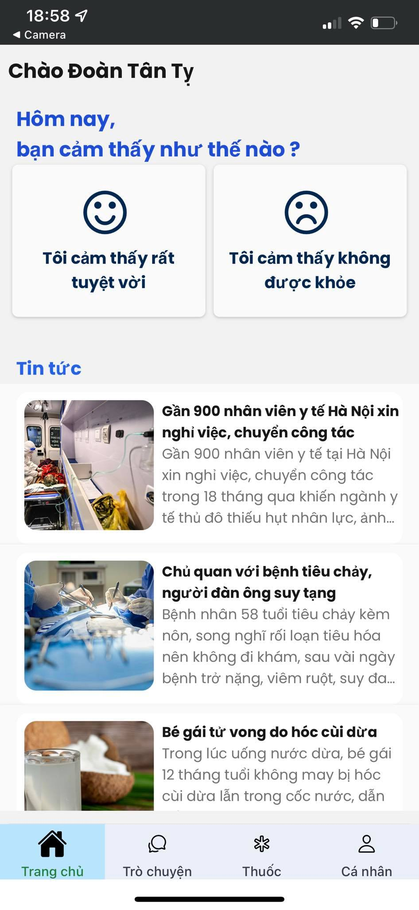
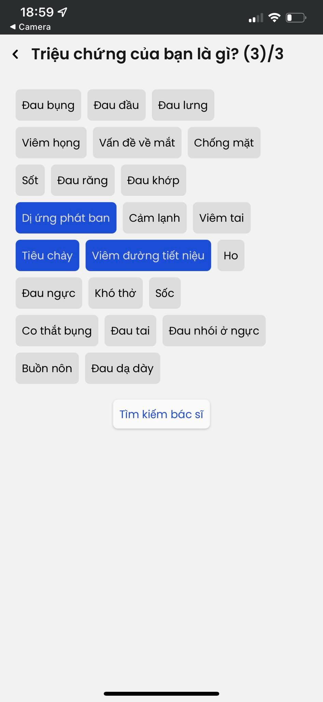
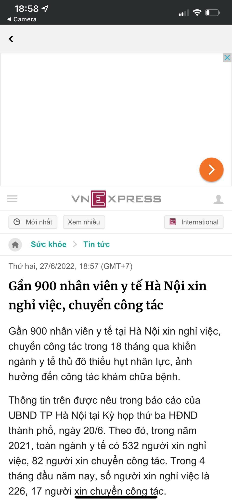
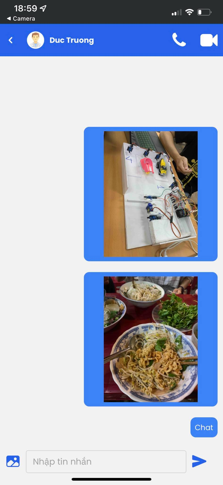
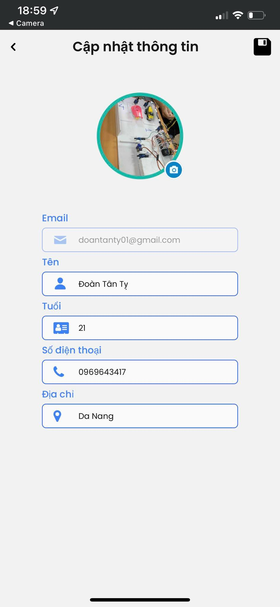

# Happy Care ( Ứng dụng hỗ trợ sức khoẻ )

Ứng dụng Tư vấn Sức khỏe Trực tuyến được xây dựng với React native cho Client, ExpressJs cho Server phụ trợ Online Health Consultation Application built with Flutter for Client, ExpressJs for Backend Server.

## Tính năng

- Đọc tin tức về sức khoẻ hàng
- Tìm kiếm bác sĩ theo chuyên khoa **(Currently, the feature is based on database, will upgrade with machine learning later)**
- Tìm bác sĩ đang online
- Hỏi người dùng tình trạng sức khoẻ hiện tại và tìm chuyên khoa theo triệu chứng ( Khi vào ứng dụng ).
- Trò chuyện 1 vs 1 giữa bác sĩ với thành viên, gửi ảnh tư vấn.
- Bác sĩ có thể kê đơn trực tiếp cho thành viên ( Sẽ cập nhật sau )..
- Quản lý thông tin người dùng.

## Công nghệ sử dụng

- React native và Redux pattern
- Xác thực và phân quyền sử dụng JWT.
- Backend sử dụng ExpressJs, MongoDB.
- Chat thời gian thực sử dụng Socket.io.
- Cloudinary để chứa ảnh và tệp tin.

## Cấu trúc dự án

project
│   README.md
│   App.js

<pre id="tree-panel"><bold>src</bold>  ┣ api  ┃ ┣ common  ┃ ┃ ┣ constants.js  ┃ ┃ ┣ enum.js  ┃ ┃ ┣ env.js  ┃ ┃ ┣ index.js  ┃ ┃ ┣ logger.js  ┃ ┃ ┗ url-config.js  ┃ ┣ helper  ┃ ┃ ┣ async-store.helper.js  ┃ ┃ ┣ index.js  ┃ ┃ ┣ jwt.helper.js  ┃ ┃ ┗ secure-store.helper.js  ┃ ┗ services  ┃ ┃ ┣ cloudinary.service.js  ┃ ┃ ┣ http.service.js  ┃ ┃ ┣ index.js  ┃ ┃ ┗ websocket.service.js  ┣ assets  ┃ ┣ images  ┃ ┃ ┣ icon-health-care.png  ┃ ┃ ┣ index.js  ┃ ┃ ┣ love.png  ┃ ┃ ┗ redux.png  ┃ ┣ adaptive-icon.png  ┃ ┣ favicon.png  ┃ ┣ icon.png  ┃ ┗ splash.png  ┣ components  ┃ ┣ layout  ┃ ┃ ┣ HCBackHeader.js  ┃ ┃ ┣ HCButton.js  ┃ ┃ ┣ HCHeader.js  ┃ ┃ ┣ HCUpdateHeader.js  ┃ ┃ ┗ index.js  ┃ ┣ navigator  ┃ ┃ ┣ auth.js  ┃ ┃ ┣ bottom-tab.js  ┃ ┃ ┣ chat.js  ┃ ┃ ┣ home.js  ┃ ┃ ┣ index.js  ┃ ┃ ┣ medicine.js  ┃ ┃ ┗ profile.js  ┃ ┗ screens  ┃ ┃ ┣ auth  ┃ ┃ ┃ ┣ Login.js  ┃ ┃ ┃ ┗ Register.js  ┃ ┃ ┣ chat  ┃ ┃ ┃ ┣ ChatLobby  ┃ ┃ ┃ ┃ ┣ Channel.js  ┃ ┃ ┃ ┃ ┣ ChannelList.js  ┃ ┃ ┃ ┃ ┣ DoctorLobby.js  ┃ ┃ ┃ ┃ ┣ MemberLobby.js  ┃ ┃ ┃ ┃ ┣ SearchDoctor.js  ┃ ┃ ┃ ┃ ┗ index.js  ┃ ┃ ┃ ┗ ChatRoom  ┃ ┃ ┃ ┃ ┣ ChatInput.js  ┃ ┃ ┃ ┃ ┣ ChatRoomHeader.js  ┃ ┃ ┃ ┃ ┣ Message.js  ┃ ┃ ┃ ┃ ┣ MessageList.js  ┃ ┃ ┃ ┃ ┗ index.js  ┃ ┃ ┣ home  ┃ ┃ ┃ ┣ Home.js  ┃ ┃ ┃ ┣ News.js  ┃ ┃ ┃ ┣ SearchDoctorBySpec.js  ┃ ┃ ┃ ┣ SearchSpecializations.js  ┃ ┃ ┃ ┣ SymptomsExpand.js  ┃ ┃ ┃ ┣ SymptomsKeyword.js  ┃ ┃ ┃ ┗ WebNews.js  ┃ ┃ ┣ medicine  ┃ ┃ ┃ ┗ Medicine.js  ┃ ┃ ┣ profile  ┃ ┃ ┃ ┣ Profile.js  ┃ ┃ ┃ ┗ UpdateProfile.js  ┃ ┃ ┗ index.js  ┗ redux  ┃ ┣ auth  ┃ ┃ ┣ auth.service.js  ┃ ┃ ┗ auth.slice.js  ┃ ┣ chat  ┃ ┃ ┣ chat.service.js  ┃ ┃ ┗ chat.slice.js  ┃ ┣ doctors  ┃ ┃ ┗ doctors.service.js  ┃ ┣ news  ┃ ┃ ┗ news.service.js  ┃ ┣ role  ┃ ┃ ┗ role.slice.js  ┃ ┣ socket  ┃ ┃ ┗ socket.slice.js  ┃ ┣ specialization  ┃ ┃ ┣ specialization.service.js  ┃ ┃ ┗ specialization.slice.js  ┃ ┣ symptoms  ┃ ┃ ┣ symptoms.service.js  ┃ ┃ ┗ symptoms.slice.js  ┃ ┣ ui  ┃ ┃ ┗ ui.slice.js  ┃ ┣ user  ┃ ┃ ┣ user.service.js  ┃ ┃ ┗ user.slice.js  ┃ ┣ actions.js  ┃ ┣ services.js  ┃ ┗ store.js</pre>

## Chuẩn bị và khởi chạy

- git clone https://github.com/TranNhuTri/HappyCare.git
- cd ./happy-care-mobile
- Cấu hình và chạy
  - Expo
    - Install [Expo](https://expo.dev/).
  - yarn
  - yarn start
- Quét mã QR và chạy

## Screenshots (Chạy thử nghiệm trên IOS và Android)

Sorry for some UIs are not designed in advance, it will be not responsive for 16:9, not as beautiful as the intro, sign in, sign up because there is no time, just code in mind 😣

### Register, Login

|                Register Screen                |                  Login Screen                  |
| :--------------------------------------------: | :--------------------------------------------: |
|  |  |

### Main Screen (Quyền member)

|                                                |                                                |                                                |
| :--------------------------------------------: | :--------------------------------------------: | :--------------------------------------------: |
|                  Home Screen                  |            Choose if you feel good            |    Choose if you feel bad to finding doctor    |
|  |  |  |
|                 More Symptoms                 |          Result for choosing symptoms          |                 Choose Doctor                 |
|  |  |  |
|                      News                      |                  Chat Screen                  |                    Profile                    |
|  |  |  |
|                 Update Profile                 |                                                |                                                |
|  |                                                |                                                |

## Sẽ làm trong tương lai

- Quản lý thuốc
- Notifications
- Tạo đơn thuốc trong chat
- Call video, thoại

## Contributors ✨

<!-- ALL-CONTRIBUTORS-LIST:START - Do not remove or modify this section -->

<!-- prettier-ignore-start -->

<!-- markdownlint-disable -->

<table>
  <tr>
    <td align="center"> <b>Trương Minh Đức</b></a> <a href="https://github.com/komkat-studio/happy-care-mobile/commits?author=dungngminh" title="Code">💻</a> <a href="https://github.com/komkat-studio/happy-care-mobile/commits?author=dungngminh" title="Documentation">📖</a>
  </tr>
</table>

<!-- markdownlint-restore -->

<!-- prettier-ignore-end -->

<!-- ALL-CONTRIBUTORS-LIST:END -->
